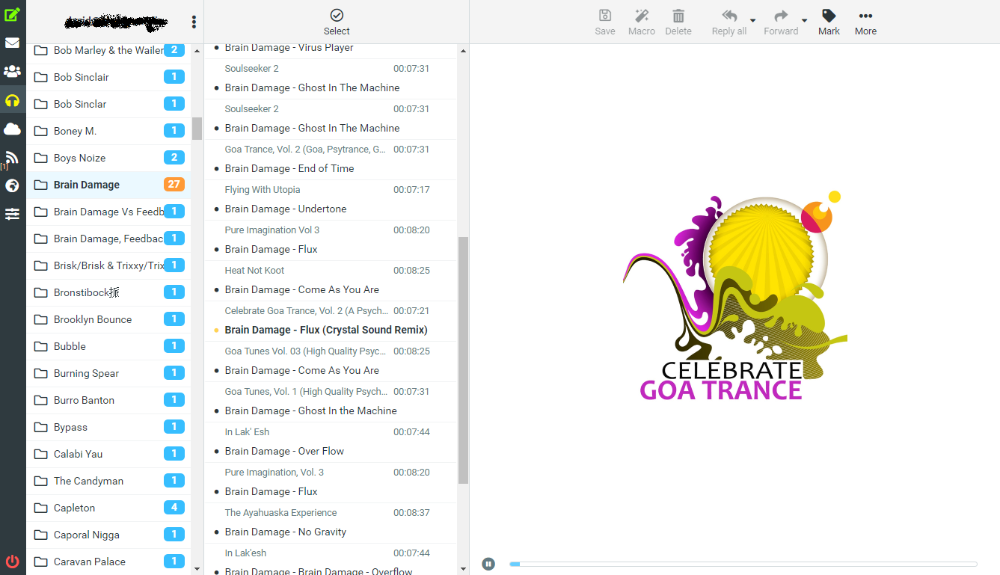
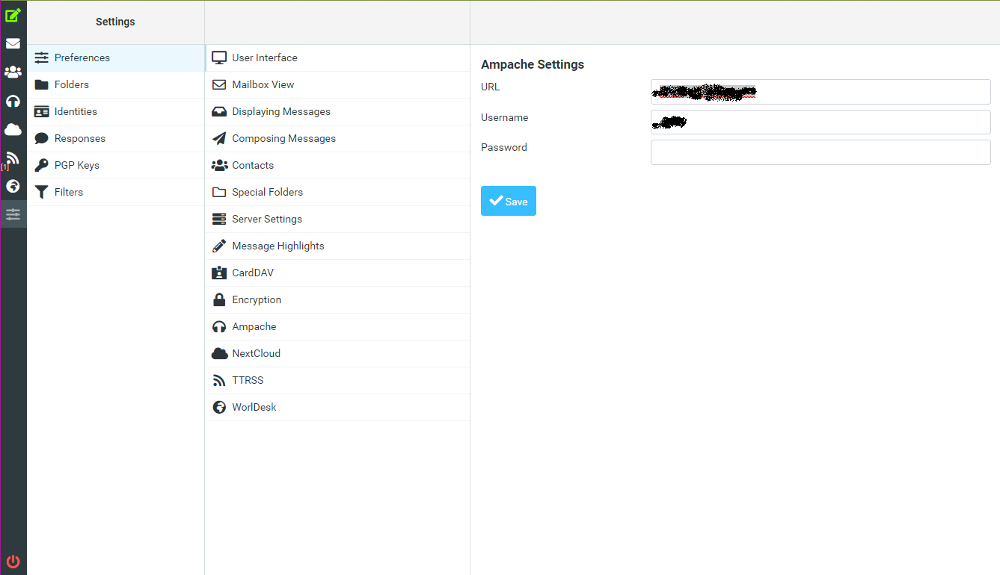

# roundcube_ampache
Embed your ampache account into your RoundCube (used the ampache API)

Install into plugins directory, go to your settings into roundcube and set your parameters
nothing more :)

**This plugins work only with RoundCube 1.4+ and with elastic skin**

#ToDO
> Added some functionalities to add, remove and custom playlist

> And, indeed remove all the menu from the mail template ...

# Screenshots

