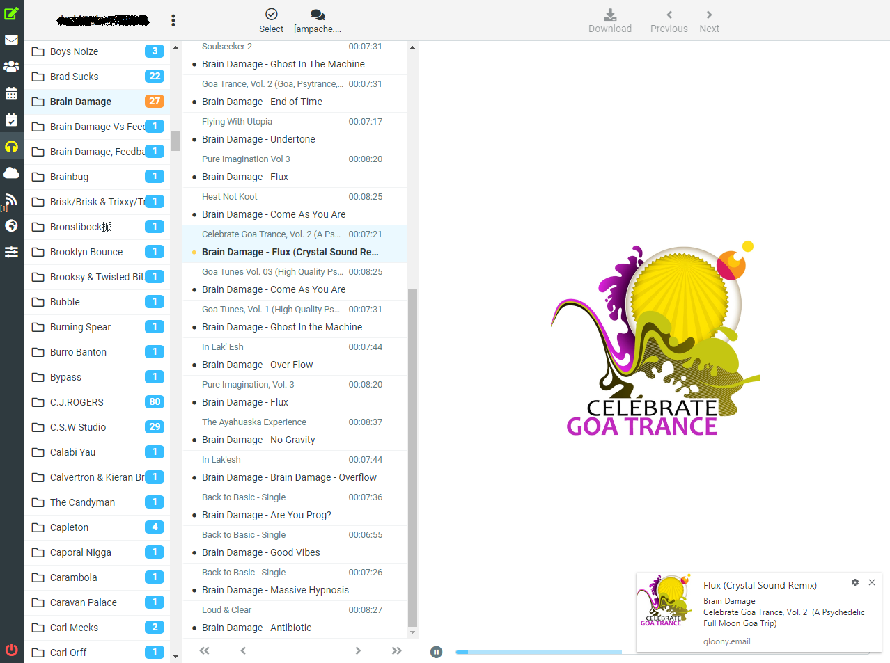

# Ampache on RoundCube

Embed your Ampache account into your RoundCube (used the Ampache API)

**This plugin work only with RoundCube 1.4+ and with elastic skin**

# Installation

```
You need a fully functional TTRSS server
Install these content into your_roundcube_root/plugins/ampache/
Configure your config.inc.php to add this plugin
Go to your settings into your RoundCube instance and add a server
```

# ToDo

```
Let the possibility to create, modify and delete playlist
Can add, remove and display favourite
Make pagination work
Crossfade on mobile will be disabled
Crossfade on desktop when user change music
Make a folder list like the mail app
Optimization
```

# Bugs

```
Selection of current folder open is borken when you change it
Missing translation at some points
Not all menu work
```

# Screenshots

